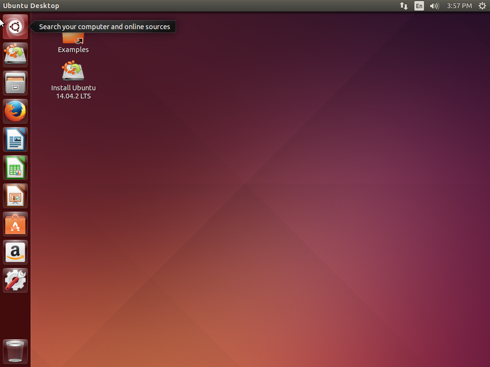
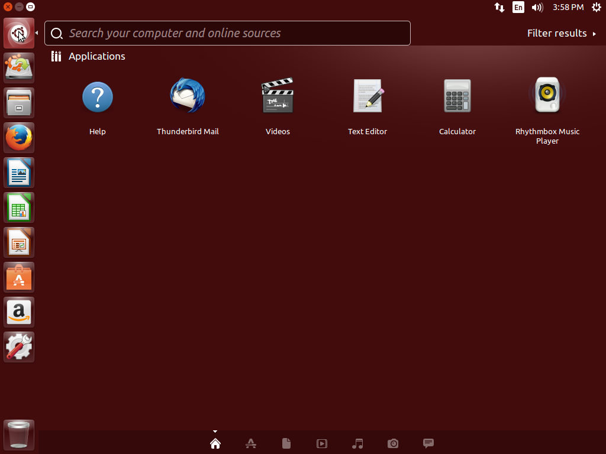
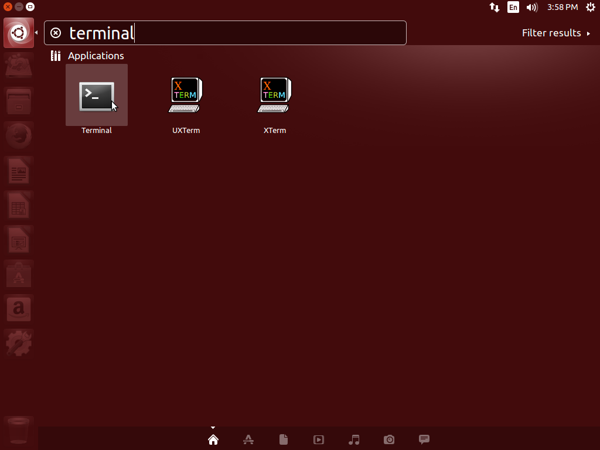

# Introduction to Linux

---

## What is Linux?
Linux is an alternative to the Windows operating system. It comes in lots of different versions and the version that we use here at university is called **Ubuntu**.

It's a piece of free and open source software that we highly recommend that you get familar with. 
Its also easy to install along side your already existing Window Install, giving you a great programming environment that is very similar to the University's but still with easy access to your existing files.

---

## Basic Overview of Ubuntu

---

### The Dock
The bar on the left hand side of the screen contains a list of your applications that are locked to it, you can lock any application to this dock.



---

### The Dash


This interface allows you to search through all of your installed applications.

It can be openned by clicking the icon at the top of the dock.



**_Open the dash and search for the terminal application and open it_**

---

### The Terminal
This application presents you with a command line interface that allows you to execute commands on your machine.

You should try to become familar with the Terminal as it plays an important part in software development. 

---

## Linux File Structure

---

### Where is the C:\ drive?
In Linux there are no labels attached to drives of the computer, so there is no C:\ or D:\ or E:\ drive. 

Instead Linux has a filesystem that starts with just a /

Beneath this root / you can have any number of files/directories.

---

Example:
```console
/
/dev/
/dev/sda
/dev/sdb
/home/
/home/<username>
/tmp/
```

Everything in linux is stored as a file or a directory. This includes any internal and external devices attached to the computer, for example, internal hard drives are stored as /dev/sda, /dev/sdb, etc.

---

### Home Directory
The most relavent one directory to you is your home directory, is has the path /home/&lt;username&gt;, however on the University machines the home directory is the /s_home/&lt;username&gt;/

This is where you will do all of your work and where all of your documents are stored.

---

## Terminal Commands

---

### pwd
This command prints the **P**resent **W**orking **D**irectory, so if you have just openned your terminal and you run this command, the text printed out should be /s_home/&lt;username&gt;/

Any command executed in the terminal will be executed relative to your present working directory.

Example:
```console
$pwd
/s_home/<username>/
```

---

### ls
This command lists the contents of the present working directory. If you run this command in your terminal now, it should print something similar to:

Example:
```console
$ls
./
../
Desktop/
public_html/
```

Currently this command will only print the files and directories, however you can pass extra options to a command, which are called flags.

---

Use can use the ls command with the 'a' flag to list all of the files and folders including those hidden and special files/folders.

Example:
```console
$ls -a
./
../
Desktop/
public_html/
```

---

Use can use the ls command with the 'l' flag to display more details about the files/folders in the present working directory.

Example:
```console
$ls -l
./
../
Desktop/
public_html/
```

---

You can also list the contents of a given directory: 

Example:
```console
$ls Downloads
first_download.pdf
second_file.txt
```

---

### Special Directories
Normally directories are named using a mixture of alpha and numeric characters. However, there are some special cases.

The ./ directory is a directory that points to the present working directory.

The ../ directory is a directory that points to the parent of the current working directory.

---

### cd
This command allows you to change the present working directory.
Example:

```console
$pwd
/s_home/as784/
```

```console
$cd public_html/
```

```console
$pwd
/s_home/as784/public_html/
```

---

You can also use the special directory names, the ../ is commonly used to move one directory upward, to the parent of the current folder. Example:

```console
$pwd
/s_home/as784/public_html/
```

```console
$cd ..
```

```console
$pwd
/s_home/as784/
```

---

### mkdir
This command allows you to create a new directory relative to the present working directory. Example:

```console
$ls
Downloads/
public_html/
```

```console
$mkdir Lectures
```

```console
$ls
Downloads/
Lectures/
public_html/
```

---

### touch
This command creates a new file with the given name. Example:

```console
$ls
Downloads/
Lectures/
public_html/
```

```console
$touch oldlecture
```

```console
$ls
Downloads/
Lectures/
oldlecture
public_html/
```

---

### mv
This command moves the specified file/directory to the specified new location.

```console
$ls
Downloads/
Lectures/
oldlecture
public_html/
```

```console
$mv oldlecture Lectures/
```

```console
$ls
Downloads/
Documents/
Lectures/
public_html/
```

```console
$ls Lectures/
oldlecture
```

---

### cp
This command can be used to make a copy of a file or directory. Example:

```console
$cd Lectures
```

```console
$ls
oldlecture
```

```console
$cp oldlecture newlecture
```

```console
$ls
oldlecture
newlecture
```

---

### rm
This command can be used to remove files/directories. Example:

```console
$ls
newlecture
oldlecture
```

```console
$rm oldlecture
```

```console
$ls
newlecture

```

